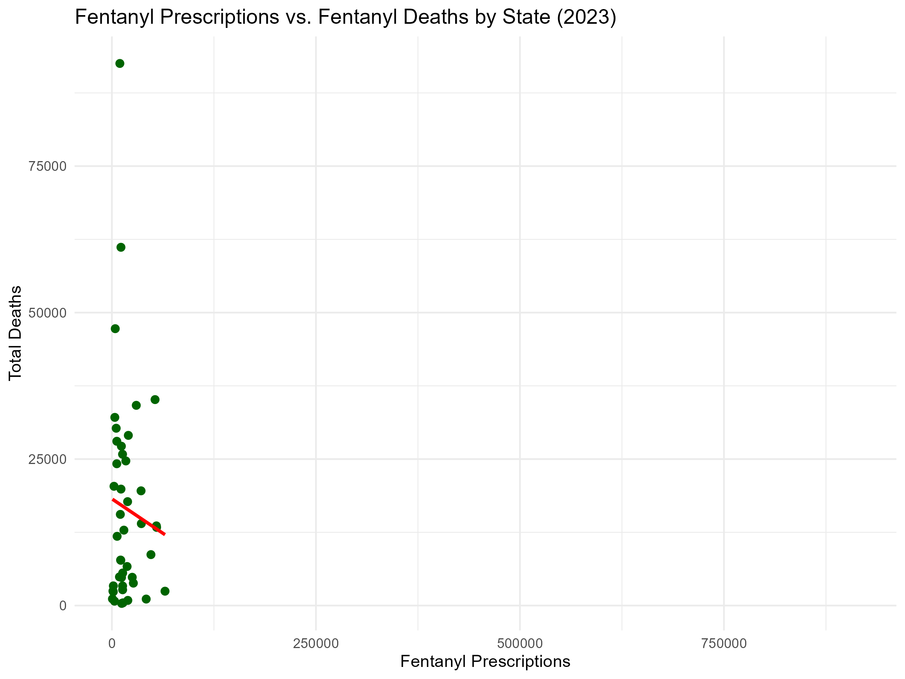
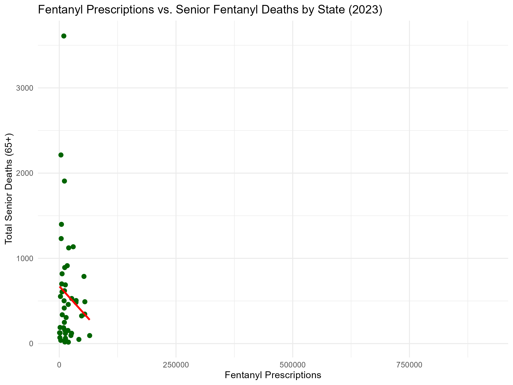

# Total US and State-by-State Fentanyl Morbidity by Frequencey of Prescriptions

Two people I cared about died of fentanyl within the last 12 months. This project is personal. The opioid crisis is not an abstract problem—it is a devastating reality that has touched my life and the lives of many people I know. Losing friends to fentanyl overdoses has changed the way I see this epidemic. I’ve been in recovery from addictions since 1984–1994 and 1997–current in 2025.

Since 2007 I’ve blogged, podcasted and written several books to help those suffering from addictions. It is with this background that the questions around fentanyl began to gnaw at my inner researcher. A search of publicly available datasets with fentanyl data yielded valid, well documented data sources to explore on this issue. Upon exploring of publicly available healthcare datasets, the immediate question that arose is part one of this study. But let's frame up the context.

The prima facie case is that the quantity of IMFs (Illicitly Manufactured Fentanyl) in the United States collectively and individually would be strongly related to overdose deaths. The CDC and others have this well established.

According to the CDC, 82% of fentanyl overdose deaths in the U.S. involve IMFs rather than prescribed pharmaceutical fentanyl. This fact is crucial because it suggests that the majority of fentanyl-related fatalities arise from illegal sources, not from prescriptions. Our analysis explores whether there is any measurable relationship between the number of prescriptions written and the number of fentanyl deaths.

The prescription data used in this analysis is sourced from Medicare Part D prescribers, which primarily covers seniors (age 65+). Seniors receive fentanyl primarily through legitimate medical channels for pain management and palliative care, making their prescription patterns fundamentally different from illicit fentanyl use on the street. This distinction is a critical factor in interpreting the results: our analysis focuses on prescriptions within a population that is less likely to contribute to illicit fentanyl overdose statistics.

Most fentanyl overdose deaths, according to CDC data, occur among younger adults (25–54) due to illicit fentanyl. Seniors may typically have lower overdose death rates from illicit fentanyl, which refined the question to apply specifically to seniors 65+.

## Central Question
**Is there a relationship between how much fentanyl is being prescribed to and the number of deaths by fentanyl overdose? Is there a difference in age groups or states?**

This is not just an academic exercise or a technical showcase. This is about making sense of a tragedy that is unfolding all around us, and about providing something useful to others who are searching for answers—whether they are policymakers, public health workers, or people who have lost someone, as I have.

## Why This Project Matters
In the United States, the opioid crisis is a daily reality for millions of families and communities. The crisis is not uniform—some places are hit harder than others, and the reasons are complex. But at the center of it all is the question of how prescription patterns, especially for extremely potent opioids like fentanyl, relate to the loss of life we are seeing.

By focusing this project on a simple, direct question, I am intentionally choosing clarity over complexity, transparency over technical obscurity, and real-world relevance over academic abstraction.

## Objective
My goal is to create an analysis that anyone can understand, regardless of their background in statistics or data science. I want this project to be accessible to people who are grieving, to professionals trying to save lives, and to anyone who wants to understand what is actually happening in their own community.

## Project Workflow

### 1. Ask
Define the problem or question:
- Is there a relationship between fentanyl prescriptions and overdose deaths by region, state, county, or prescriber?

### 2. Prepare
Collect and clean relevant datasets:
- Medicare Part D Prescribers 2023
- CDC WONDER Multiple Cause of Death 2018–2023
- U.S. Census Bureau TIGER/Line Shapefiles

### 3. Process
Clean, merge, and preprocess data for analysis:
- Handle missing values
- Standardize fields
- Ensure data integrity

### 4. Analyze
Perform exploratory and statistical analyses:
- Summary statistics
- Visualizations
- Correlation analysis

### 5. Share
Present findings using:
- Quarto reports
- GitHub repository
- Visuals and tables

### 6. Act
- Discuss insights and implications
- Propose future research or recommendations

---

# Results
The EDA (Exploratory Data Analysis) showed a relationship of zero or slightly negative between prescriptions and deaths nationwide, so I looked at each state with the same results. Then it occurred to me that since the Medicare data was limited to 65+ in most cases, it wasn't an apples to apples comparison against an all ages mortality dataframe.

A filter for age was then put in place and the EDA was rerun.

Since the mortality data covers all ages, I decided to filter for seniors 50+ in five year groups and rerun everything. The results confirmed that there is no significant positive relationship between fentanyl prescriptions and overdoses either across all age groups or controlled for seniors.

**Correlation (Fentanyl Prescriptions vs. All-Age Deaths):** -0.1250  
**Correlation (Fentanyl Prescriptions vs. Senior Deaths):** -0.1474  

---

## Figures

**Figure 1: Fentanyl Prescriptions vs. All-Age Deaths**  
  
This scatter plot shows the correlation between fentanyl prescriptions and all-age fentanyl-related deaths by state in 2023.  
**Correlation Coefficient:** -0.1250

**Figure 2: Fentanyl Prescriptions vs. Senior Deaths (65+)**  
  
This scatter plot focuses exclusively on seniors (65+) and compares the number of fentanyl prescriptions with fentanyl-related deaths in this age group.  
**Correlation Coefficient:** -0.1474

---

# Next Steps
- Include county-level data to identify regional hotspots.
- Integrate socio-economic indicators for deeper insights.
- Expand EDA to time-series trends for 2018–2023.
- Prepare a public-facing dashboard with these correlations and visualizations.

---

# SMART Goal Summary

- **Specific:** Analyze U.S. fentanyl prescription and overdose data.
- **Measurable:** Compare prescription volume to overdose rates.
- **Achievable:** Use public datasets (CMS, CDC, NCHS).
- **Relevant:** Address national opioid crisis.
- **Time-bound:** Deliver project by July 2025.
